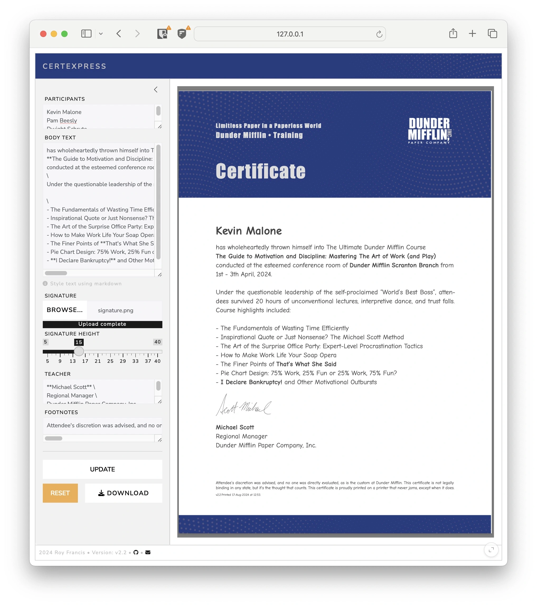

# CertExpress

[](https://github.com/royfrancis/certexpress/actions/workflows/main.yml)

An app to create PDF certificates for courses.



## How to run this app?

This app can be run in many ways from just accessing a URL to installing the dependencies and building it locally.

### Online

View the app on [shinyapps.io](https://mindlessgreen.shinyapps.io/certexpress/).

### Run a pre-built docker image

:exclamation: Docker image is about 2.2GB

```
docker run --platform=linux/amd64 --rm -p 3838:3838 ghcr.io/royfrancis/certexpress:latest
```

The app should be available through a web browser at `http://0.0.0.0:3838`.

### Build and run a docker image

Clone this repo and run:

```
docker build --platform=linux/amd64 -t certexpress:latest .
docker run --platform=linux/amd64 --rm -p 3838:3838 certexpress:latest
```

### Manually using R and quarto

- Install quarto, R and the following R packages:

```r
install.packages(c("shiny","bslib","quarto","markdown"))
```

Tested on the following version:

```
R version 4.4.1
shiny_1.8.1.1
markdown_1.13
quarto_1.4.4
bslib_0.7.0
```

- Clone this repo, open R and run

```
shiny::runApp()
```

## How does it work?

The shiny app captures user input which is passed into a quarto document. The quarto document uses a typst certificate template which is used to create a PDF. The PDF is displayed in the app preview or downloaded as a zip file. When multiple names are provided, PDFs are created for each name into a folder which is then zipped for download.

---

2024 • Roy Francis
